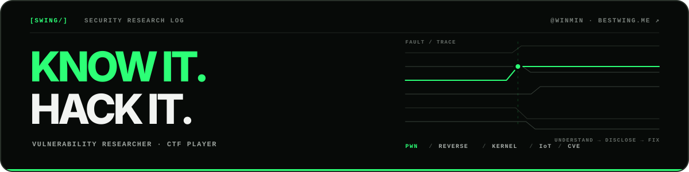

  <picture>
    <source media="(prefers-color-scheme: dark)" srcset="./assets/hero-dark.svg" />
    <source media="(prefers-color-scheme: light)" srcset="./assets/hero-light.svg" />
    
  </picture>

  

    <a href="https://bestwing.me"><b>Blog ↗</b></a>
    ·
    <a href="https://twitter.com/bestswngs"><b>X ↗</b></a>
    ·
    <a href="#disclosure-archive"><b>CVEs ↓</b></a>
  

## About

I research vulnerabilities in the **Linux kernel**, **embedded systems**, and **network appliances**. My work spans source auditing, fuzzing, exploit development, and responsible disclosure.

CTF player with [FlappyPig](https://github.com/FlappyPig) and [r3kapig](http://r3kapig.com/).

<!-- IMPACT_START -->
> **85 public CVEs** across **11 ecosystems**, including **47 Linux kernel findings**.
<!-- IMPACT_END -->

## Selected research

- [**PackageKit TOCTOU Local Privilege Escalation**](https://bestwing.me/CVE-2026-41651-analysis.html) 
  Linux · TOCTOU · Local privilege escalation

- [**Xiaomi: From ADB Service Call to Bootloader Unlock**](https://bestwing.me/preempted-unlocking-xiaomi-via-two-unsanitized-strings.html) 
  Android · Qualcomm · Bootloader security

- [**ASUS IoT: Hide-and-Seek with Security**](https://bestwing.me/offbyone-conference-when-asus-iot-devices-play-hide-and-seek-with-security.html) 
  IoT · Router · Vulnerability research

## Focus

- **Surfaces** — Linux kernel, embedded devices, IoT, and network appliances
- **Methods** — source auditing, fuzzing, reverse engineering, and exploit development
- **Practice** — PWN, CTF, root-cause analysis, and responsible disclosure

## Recognition

- **2025 · 1st place** — 0x300 · 天网杯信创关键产品漏洞挖掘挑战赛
- **2024 · Two 1st-place finishes** — 0x300 · 天网杯信创关键产品漏洞挖掘挑战赛、矩阵杯国产软硬件安全检测赛
- **2023 · Champion** — 跃哥我真不会啊 · Datacon 漏洞分析赛道 
  **2nd place** — 0x300 · CSST 天网杯

<b>Earlier recognition</b> · 2018–2021

- **2021 · 2nd place** — 0x300 · 首届信创关键产品安全挑战赛 
  **Best Vulnerability Reproduction** — 天府杯 · Docker Escape & Ubuntu LPE
- **2019** — Chaitin · GeekPwn & HUAWEI Smart Device Security Challenge · MAXHUB Exploit
- **2018 · Best Demo Award** — Piggy mine · GeekPwn

## Publications

- **《CTF特训营：技术详解、解题方法与竞赛技巧》** — *Author*
- **《硬件系统模糊测试技术解密与案例分析》** — *Translator*

## Disclosure archive

The archive below is synchronized from [bestwing.me](https://bestwing.me/about/) every week.

<b>Browse the complete CVE index</b> · grouped by vendor

 

<!-- CVE_START -->
**HUAWEI**: [CVE-2019-5268](https://www.huawei.com/cn/psirt/security-advisories/huawei-sa-20191113-01-homerouter-cn) | [CVE-2019-5269](https://www.huawei.com/cn/psirt/security-advisories/huawei-sa-20191113-01-homerouter-cn)

**DrayTek**: [CVE-2020-14472](https://www.draytek.com/about/security-advisory/vigor3900-/-vigor2960-/-vigor300b-remote-code-injection/execution-vulnerability-(cve-2020-14472)/) | [CVE-2020-14473](https://www.draytek.com/about/security-advisory/vigor3900-/-vigor2960-/-vigor300b-stack-based-buffer-overflow-vulnerability-(cve-2020-14473)/)

**QNAP**: [CVE-2020-2490](https://www.qnap.com/en/security-advisory/qsa-20-09) | [CVE-2020-2492](https://www.qnap.com/en/security-advisory/qsa-20-09)

**CISCO**: [CVE-2021-1207](https://tools.cisco.com/security/center/content/CiscoSecurityAdvisory/cisco-sa-rv-overflow-WUnUgv4U) | [CVE-2021-1209](https://tools.cisco.com/security/center/content/CiscoSecurityAdvisory/cisco-sa-rv-overflow-WUnUgv4U) | [CVE-2021-1164](https://tools.cisco.com/security/center/content/CiscoSecurityAdvisory/cisco-sa-rv-overflow-WUnUgv4U) | [CVE-2021-1307](https://tools.cisco.com/security/center/content/CiscoSecurityAdvisory/cisco-sa-rv-overflow-WUnUgv4U) | [CVE-2021-1293](https://tools.cisco.com/security/center/content/CiscoSecurityAdvisory/cisco-sa-rv160-260-rce-XZeFkNHf) | [CVE-2021-1295](https://tools.cisco.com/security/center/content/CiscoSecurityAdvisory/cisco-sa-rv160-260-rce-XZeFkNHf) | [CVE-2021-1609](https://tools.cisco.com/security/center/content/CiscoSecurityAdvisory/cisco-sa-rv340-cmdinj-rcedos-pY8J3qfy) | [CVE-2021-1610](https://tools.cisco.com/security/center/content/CiscoSecurityAdvisory/cisco-sa-rv340-cmdinj-rcedos-pY8J3qfy)

**D-Link**: [CVE-2020-25506](https://supportannouncement.us.dlink.com/announcement/publication.aspx?name=SAP10183)

**ZYXEL**: [CVE-2020-29299](https://www.zyxel.com/support/Zyxel-security-advisory-for-command-injection-vulnerability-of-firewalls.shtml)

**XIAOMI**: [CVE-2020-14102](https://privacy.mi.com/trust#/security/vulnerability-management/vulnerability-announcement/detail?id=23&locale=zh)

**Linux Kernel**: [CVE-2021-4001](https://access.redhat.com/security/cve/CVE-2021-4001) | CVE-2025-38477 | CVE-2025-40083 | CVE-2025-68325 | [CVE-2026-22977](https://vulert.com/vuln-db/net--sock--fix-hardened-usercopy-panic-in-sock-recv-errqueue) | CVE-2026-23276 | CVE-2026-23277 | CVE-2026-23396 | CVE-2026-23397 | CVE-2026-23398 | CVE-2026-31419 | CVE-2026-31420 | CVE-2026-31421 | CVE-2026-31422 | CVE-2026-31423 | CVE-2026-31424 | CVE-2026-31425 | CVE-2026-31426 | CVE-2026-31427 | CVE-2026-31428 | CVE-2026-43085 | CVE-2026-43086 | CVE-2026-45837 | CVE-2026-45838 | CVE-2026-45839 | CVE-2026-45840 | CVE-2026-45841 | CVE-2026-45842 | CVE-2026-45843 | CVE-2026-45844 | CVE-2026-45845 | CVE-2026-45846 | CVE-2026-46320 | CVE-2026-46321 | CVE-2026-46322 | CVE-2026-53349 | [CVE-2026-52937](https://git.kernel.org/pub/scm/linux/kernel/git/stable/linux.git/commit/?id=bddc09212c24) | [CVE-2026-52938](https://git.kernel.org/pub/scm/linux/kernel/git/stable/linux.git/commit/?id=375e4e33c18d) | [CVE-2026-52939](https://git.kernel.org/pub/scm/linux/kernel/git/stable/linux.git/commit/?id=34080db3e70d) | [CVE-2026-52940](https://git.kernel.org/pub/scm/linux/kernel/git/stable/linux.git/commit/?id=7f2fcff15e99) | [CVE-2026-52941](https://git.kernel.org/pub/scm/linux/kernel/git/stable/linux.git/commit/?id=7bf563badd37) | [CVE-2026-52942](https://git.kernel.org/pub/scm/linux/kernel/git/stable/linux.git/commit/?id=a84b6fedbc97) | [CVE-2026-64187](https://git.kernel.org/pub/scm/linux/kernel/git/stable/linux.git/commit/?id=2094dab19d45c487285617b7b68913d0cc0c1211) | [CVE-2026-64188](https://git.kernel.org/pub/scm/linux/kernel/git/stable/linux.git/commit/?id=d00c953a8f69) | [CVE-2026-64189](https://git.kernel.org/pub/scm/linux/kernel/git/stable/linux.git/commit/?id=7cd9103283b26b917360ec99d7d2f2d761bcf1ab) | [CVE-2026-64190](https://git.kernel.org/pub/scm/linux/kernel/git/torvalds/linux.git/commit/?id=25fe708bbc59289d3d1ea4b126fbc1b460a072a5) | [CVE-2026-64191](https://git.kernel.org/pub/scm/linux/kernel/git/stable/linux.git/commit/?id=6036b5067a8199ba7a2dc7b377d4b9dd276d5f9e)

**Netgear**: [CVE-2021-45527](https://kb.netgear.com/000064493/Security-Advisory-for-Post-Authentication-Buffer-Overflow-on-Some-Routers-Extenders-and-WiFi-Systems-PSV-2020-0437) | [CVE-2023-36187](https://kb.netgear.com/000065571/Security-Advisory-for-Pre-Authentication-Buffer-Overflow-on-Some-Routers-PSV-2020-0578)

**ASUS**: CVE-2023-35086 | CVE-2023-35087 | CVE-2023-39238 | CVE-2023-39239 | CVE-2023-39240 | CVE-2024-3079 | CVE-2024-3080

**Other**: CVE-2021-33630 | CVE-2021-33631 | [CVE-2021-29629](https://www.freebsd.org/security/advisories/FreeBSD-SA-21:12.libradius.asc) | [CVE-2020-15137](https://github.com/jwise/HoRNDIS/security/advisories/GHSA-8q4r-m3rh-57jx) | CVE-2020-24074 | CVE-2020-15173 | CVE-2020-28194 | CVE-2020-36109 | [CVE-2023-24805](https://github.com/OpenPrinting/cups-filters/security/advisories/GHSA-gpxc-v2m8-fr3x) | CVE-2022-43294 | [CVE-2026-9539](https://gitlab.freedesktop.org/slirp/libslirp/-/work_items/93#note_3533363) | [CVE-2026-22777](https://github.com/Comfy-Org/ComfyUI-Manager/security/advisories/GHSA-562r-8445-54r2)

<!-- CVE_END -->

### Acknowledgements

- **Synology** — [2021 Security Bounty Acknowledgement](https://www.synology.com/zh-tw/security/bounty_program#acknowledgement)
- **OPPO** — 2021 IoT Bug Bounty [Top 18](https://security.oppo.com/cn/charts)

---

  <b>KNOW IT. HACK IT.</b> · Research responsibly. Disclose clearly. · <a href="https://bestwing.me">bestwing.me</a>

