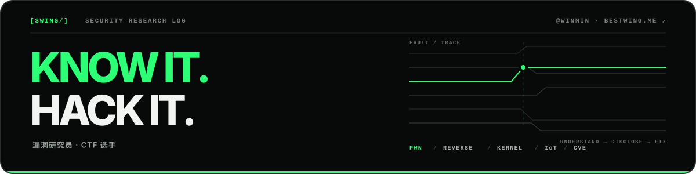

  语言：<a href="./README.md">English</a> · <b>简体中文</b>

  <picture>
    <source media="(prefers-color-scheme: dark)" srcset="./assets/hero-dark-zh.svg" />
    <source media="(prefers-color-scheme: light)" srcset="./assets/hero-light-zh.svg" />
    
  </picture>

  

    <a href="https://bestwing.me"><b>博客 ↗</b></a>
    ·
    <a href="https://twitter.com/bestswngs"><b>X ↗</b></a>
    ·
    <a href="#disclosure-archive"><b>漏洞档案 ↓</b></a>
  

## 关于

我专注于 **Linux 内核**、**嵌入式系统**与**网络设备**的漏洞研究，涉及源码审计、模糊测试、漏洞利用开发与负责任披露。

同时是 [FlappyPig](https://github.com/FlappyPig) 与 [r3kapig](http://r3kapig.com/) 战队成员。

<!-- IMPACT_START -->
> **公开披露 106 个 CVE**，覆盖 **12 个研究生态**，其中包括 **67 个 Linux 内核漏洞**。
<!-- IMPACT_END -->

## 精选研究

- [**议题分享：When ASUS IoT Devices Play Hide-and-Seek with Security**](https://bestwing.me/offbyone-conference-when-asus-iot-devices-play-hide-and-seek-with-security.html) 
  Off-By-One Conference · ASUS 路由器 · IoT 安全

- [**议题分享：企业设备安全设备漏洞分析与利用**](https://bestwing.me/Security-Equipment-Vulnerability-Research.html) 
  “安全光网”网络安全技术论坛 · 先知沙龙 · 网关 / 防火墙 / VPN

- [**议题分享：Vigor2960 Memoirs — Pursuit of the Elusive 0day & 1day**](https://bestwing.me/Vigor2960-Memoirs-Pursuit-of-the-Elusive.html) 
  长沙信息物理系统安全技术沙龙 · DrayTek · Vigor2960

## 研究方向

- **研究对象** — Linux 内核、嵌入式设备、IoT 与网络设备
- **研究方法** — 源码审计、模糊测试、逆向工程与漏洞利用开发
- **实践领域** — PWN、CTF、根因分析与负责任披露

## 荣誉

- **2025 · 第一名** — 0x300 · 天网杯信创关键产品漏洞挖掘挑战赛
- **2024 · 两项第一名** — 0x300 · 天网杯信创关键产品漏洞挖掘挑战赛、矩阵杯国产软硬件安全检测赛
- **2023 · 冠军** — 跃哥我真不会啊 · Datacon 漏洞分析赛道 
  **第二名** — 0x300 · CSST 天网杯

<b>早期荣誉</b> · 2018–2021

- **2021 · 第二名** — 0x300 · 首届信创关键产品安全挑战赛 
  **最佳漏洞复现奖** — 天府杯 · Docker Escape & Ubuntu LPE
- **2019** — Chaitin · GeekPwn & HUAWEI Smart Device Security Challenge · MAXHUB Exploit
- **2018 · 最佳演示奖** — Piggy mine · GeekPwn

## 出版物

- **《CTF特训营：技术详解、解题方法与竞赛技巧》** — *作者*
- **《硬件系统模糊测试技术解密与案例分析》** — *译者*

## 漏洞档案

以下漏洞档案每周从 [bestwing.me](https://bestwing.me/about/) 自动同步。

<b>查看完整 CVE 索引</b> · 按厂商分类

 

<!-- CVE_START -->
**HUAWEI**: [CVE-2019-5268](https://www.huawei.com/cn/psirt/security-advisories/huawei-sa-20191113-01-homerouter-cn) | [CVE-2019-5269](https://www.huawei.com/cn/psirt/security-advisories/huawei-sa-20191113-01-homerouter-cn)

**DrayTek**: [CVE-2020-14472](https://www.draytek.com/about/security-advisory/vigor3900-/-vigor2960-/-vigor300b-remote-code-injection/execution-vulnerability-(cve-2020-14472)/) | [CVE-2020-14473](https://www.draytek.com/about/security-advisory/vigor3900-/-vigor2960-/-vigor300b-stack-based-buffer-overflow-vulnerability-(cve-2020-14473)/)

**QNAP**: [CVE-2020-2490](https://www.qnap.com/en/security-advisory/qsa-20-09) | [CVE-2020-2492](https://www.qnap.com/en/security-advisory/qsa-20-09)

**CISCO**: [CVE-2021-1207](https://tools.cisco.com/security/center/content/CiscoSecurityAdvisory/cisco-sa-rv-overflow-WUnUgv4U) | [CVE-2021-1209](https://tools.cisco.com/security/center/content/CiscoSecurityAdvisory/cisco-sa-rv-overflow-WUnUgv4U) | [CVE-2021-1164](https://tools.cisco.com/security/center/content/CiscoSecurityAdvisory/cisco-sa-rv-overflow-WUnUgv4U) | [CVE-2021-1307](https://tools.cisco.com/security/center/content/CiscoSecurityAdvisory/cisco-sa-rv-overflow-WUnUgv4U) | [CVE-2021-1293](https://tools.cisco.com/security/center/content/CiscoSecurityAdvisory/cisco-sa-rv160-260-rce-XZeFkNHf) | [CVE-2021-1295](https://tools.cisco.com/security/center/content/CiscoSecurityAdvisory/cisco-sa-rv160-260-rce-XZeFkNHf) | [CVE-2021-1609](https://tools.cisco.com/security/center/content/CiscoSecurityAdvisory/cisco-sa-rv340-cmdinj-rcedos-pY8J3qfy) | [CVE-2021-1610](https://tools.cisco.com/security/center/content/CiscoSecurityAdvisory/cisco-sa-rv340-cmdinj-rcedos-pY8J3qfy)

**D-Link**: [CVE-2020-25506](https://supportannouncement.us.dlink.com/announcement/publication.aspx?name=SAP10183)

**ZYXEL**: [CVE-2020-29299](https://www.zyxel.com/support/Zyxel-security-advisory-for-command-injection-vulnerability-of-firewalls.shtml)

**XIAOMI**: [CVE-2020-14102](https://privacy.mi.com/trust#/security/vulnerability-management/vulnerability-announcement/detail?id=23&locale=zh)

**Linux Kernel**: [CVE-2021-4001](https://access.redhat.com/security/cve/CVE-2021-4001) | [CVE-2025-38477](https://git.kernel.org/stable/c/5e28d5a3f774f118896aec17a3a20a9c5c9dfc64) | [CVE-2025-40083](https://git.kernel.org/stable/c/dd831ac8221e691e9e918585b1003c7071df0379) | [CVE-2025-68325](https://git.kernel.org/stable/c/9fefc78f7f02d71810776fdeb119a05a946a27cc) | [CVE-2026-22977](https://vulert.com/vuln-db/net--sock--fix-hardened-usercopy-panic-in-sock-recv-errqueue) | [CVE-2026-23276](https://git.kernel.org/stable/c/6f1a9140ecda3baba3d945b9a6155af4268aafc4) | [CVE-2026-23277](https://git.kernel.org/stable/c/0cc0c2e661af418bbf7074179ea5cfffc0a5c466) | [CVE-2026-23396](https://git.kernel.org/stable/c/c73bb9a2d33bf81f6eecaa0f474b6c6dbe9855bd) | [CVE-2026-23397](https://git.kernel.org/stable/c/dbdfaae9609629a9569362e3b8f33d0a20fd783c) | [CVE-2026-23398](https://git.kernel.org/stable/c/614aefe56af8e13331e50220c936fc0689cf5675) | [CVE-2026-31419](https://git.kernel.org/stable/c/2884bf72fb8f03409e423397319205de48adca16) | [CVE-2026-31420](https://git.kernel.org/stable/c/fa6e24963342de4370e3a3c9af41e38277b74cf3) | [CVE-2026-31421](https://git.kernel.org/stable/c/faeea8bbf6e958bf3c00cb08263109661975987c) | [CVE-2026-31422](https://git.kernel.org/stable/c/1a280dd4bd1d616a01d6ffe0de284c907b555504) | [CVE-2026-31423](https://git.kernel.org/stable/c/4576100b8cd03118267513cafacde164b498b322) | [CVE-2026-31424](https://git.kernel.org/stable/c/3d5d488f11776738deab9da336038add95d342d1) | [CVE-2026-31425](https://git.kernel.org/stable/c/a54ecccfae62c5c85259ae5ea5d9c20009519049) | [CVE-2026-31426](https://git.kernel.org/stable/c/f6484cadbcaf26b5844b51bd7307a663dda48ef6) | [CVE-2026-31427](https://git.kernel.org/stable/c/6a2b724460cb67caed500c508c2ae5cf012e4db4) | [CVE-2026-31428](https://git.kernel.org/stable/c/52025ebaa29f4eb4ed8bf92ce83a68f24ab7fdf7) | [CVE-2026-43085](https://git.kernel.org/stable/c/1f3083aec8836213da441270cdb1ab612dd82cf4) | [CVE-2026-43086](https://git.kernel.org/stable/c/9a91797e61d286805ae10a92cc48959c30800556) | [CVE-2026-45837](https://git.kernel.org/stable/c/4fddde2a732de60bb97e3307d4eb69ac5f1d2b74) | [CVE-2026-45838](https://git.kernel.org/stable/c/5828b9e5b272ecff7cf5d345128d3de7324117f7) | [CVE-2026-45839](https://git.kernel.org/stable/c/1c22483a2c4bbf747787f328392ca3e68619c4dc) | [CVE-2026-45840](https://git.kernel.org/stable/c/2091c6aa0df6aba47deb5c8ab232b1cb60af3519) | [CVE-2026-45841](https://git.kernel.org/stable/c/2195574dc6d9017d32ac346987e12659f931d932) | [CVE-2026-45842](https://git.kernel.org/stable/c/e76607442d5b73e1ba6768f501ef815bb58c2c0e) | [CVE-2026-45843](https://git.kernel.org/stable/c/4c1367a2d7aad643a6f87c6931b13cc1a25e8ca7) | [CVE-2026-45844](https://git.kernel.org/stable/c/1e8e3f449b1e73b73a843257635b9c50f0cc0f0a) | [CVE-2026-45845](https://git.kernel.org/stable/c/3d07ca5c0fae311226f737963984bd94bb159a87) | [CVE-2026-45846](https://git.kernel.org/stable/c/aa6c6d9ee064aabfede4402fd1283424e649ca19) | [CVE-2026-46320](https://git.kernel.org/stable/c/3bcf7aec6a9d16438f2cec29f5d7c8d5b8edf9b2) | [CVE-2026-46321](https://git.kernel.org/stable/c/f4feb1e20058e407cb00f45aff47f5b7e19a6bbf) | [CVE-2026-46322](https://git.kernel.org/stable/c/aa8963fdce667a42fb7f0bdd2909fadcab02f9a8) | [CVE-2026-53349](https://git.kernel.org/stable/c/c3009418f9fa1dcb3eb86f4d8c92583537b5faa3) | [CVE-2026-52937](https://git.kernel.org/pub/scm/linux/kernel/git/stable/linux.git/commit/?id=bddc09212c24) | [CVE-2026-52938](https://git.kernel.org/pub/scm/linux/kernel/git/stable/linux.git/commit/?id=375e4e33c18d) | [CVE-2026-52939](https://git.kernel.org/pub/scm/linux/kernel/git/stable/linux.git/commit/?id=34080db3e70d) | [CVE-2026-52940](https://git.kernel.org/pub/scm/linux/kernel/git/stable/linux.git/commit/?id=7f2fcff15e99) | [CVE-2026-52941](https://git.kernel.org/pub/scm/linux/kernel/git/stable/linux.git/commit/?id=7bf563badd37) | [CVE-2026-52942](https://git.kernel.org/pub/scm/linux/kernel/git/stable/linux.git/commit/?id=a84b6fedbc97) | [CVE-2026-64187](https://git.kernel.org/pub/scm/linux/kernel/git/stable/linux.git/commit/?id=2094dab19d45c487285617b7b68913d0cc0c1211) | [CVE-2026-64188](https://git.kernel.org/pub/scm/linux/kernel/git/stable/linux.git/commit/?id=d00c953a8f69) | [CVE-2026-64189](https://git.kernel.org/pub/scm/linux/kernel/git/stable/linux.git/commit/?id=7cd9103283b26b917360ec99d7d2f2d761bcf1ab) | [CVE-2026-64190](https://git.kernel.org/pub/scm/linux/kernel/git/torvalds/linux.git/commit/?id=25fe708bbc59289d3d1ea4b126fbc1b460a072a5) | [CVE-2026-64191](https://git.kernel.org/pub/scm/linux/kernel/git/stable/linux.git/commit/?id=6036b5067a8199ba7a2dc7b377d4b9dd276d5f9e) | [CVE-2026-64411](https://git.kernel.org/pub/scm/linux/kernel/git/stable/linux.git/commit/?id=a622d2e9608c9dff47fc2e5759ac7aa3a836b45d) | [CVE-2026-64537](https://git.kernel.org/pub/scm/linux/kernel/git/stable/linux.git/commit/?id=f3e02edd8322) | [CVE-2026-64538](https://git.kernel.org/pub/scm/linux/kernel/git/stable/linux.git/commit/?id=46c3b8191aad) | [CVE-2026-64539](https://git.kernel.org/pub/scm/linux/kernel/git/stable/linux.git/commit/?id=6f5fb689fdf8) | [CVE-2026-64540](https://git.kernel.org/pub/scm/linux/kernel/git/stable/linux.git/commit/?id=8ff7f2a6da4f) | [CVE-2026-64541](https://git.kernel.org/pub/scm/linux/kernel/git/stable/linux.git/commit/?id=9d160b35cc34) | [CVE-2026-64542](https://git.kernel.org/pub/scm/linux/kernel/git/stable/linux.git/commit/?id=d186e942365a) | [CVE-2026-64543](https://git.kernel.org/pub/scm/linux/kernel/git/stable/linux.git/commit/?id=1579342d7113) | [CVE-2026-64544](https://git.kernel.org/pub/scm/linux/kernel/git/stable/linux.git/commit/?id=f7dd32c5179d) | [CVE-2026-64545](https://git.kernel.org/pub/scm/linux/kernel/git/stable/linux.git/commit/?id=e82d8cc4321c) | [CVE-2026-64546](https://git.kernel.org/pub/scm/linux/kernel/git/stable/linux.git/commit/?id=faaa1e115583) | [CVE-2026-64547](https://git.kernel.org/pub/scm/linux/kernel/git/stable/linux.git/commit/?id=03f384bc0cb8) | [CVE-2026-64548](https://git.kernel.org/pub/scm/linux/kernel/git/stable/linux.git/commit/?id=0c0a8ed85349) | [CVE-2026-64549](https://git.kernel.org/pub/scm/linux/kernel/git/stable/linux.git/commit/?id=dd068ef04412) | [CVE-2026-64550](https://git.kernel.org/pub/scm/linux/kernel/git/stable/linux.git/commit/?id=f0f1887a9e30) | [CVE-2026-64551](https://git.kernel.org/pub/scm/linux/kernel/git/stable/linux.git/commit/?id=1cd23ca80784) | [CVE-2026-64552](https://git.kernel.org/pub/scm/linux/kernel/git/stable/linux.git/commit/?id=9e5ad06ea826) | [CVE-2026-64553](https://git.kernel.org/pub/scm/linux/kernel/git/stable/linux.git/commit/?id=aedd02af1f8b) | [CVE-2026-64554](https://git.kernel.org/pub/scm/linux/kernel/git/stable/linux.git/commit/?id=86f3ce81dd2b) | [CVE-2026-64555](https://git.kernel.org/pub/scm/linux/kernel/git/stable/linux.git/commit/?id=ff1022c3de46)

**Netgear**: [CVE-2021-45527](https://kb.netgear.com/000064493/Security-Advisory-for-Post-Authentication-Buffer-Overflow-on-Some-Routers-Extenders-and-WiFi-Systems-PSV-2020-0437) | [CVE-2023-36187](https://kb.netgear.com/000065571/Security-Advisory-for-Pre-Authentication-Buffer-Overflow-on-Some-Routers-PSV-2020-0578)

**ASUS**: CVE-2023-35086 | CVE-2023-35087 | CVE-2023-39238 | CVE-2023-39239 | CVE-2023-39240 | CVE-2024-3079 | CVE-2024-3080

**QEMU**: [CVE-2026-66900](https://gitlab.com/qemu-project/qemu/-/issues/3879)

**Other**: CVE-2021-33630 | CVE-2021-33631 | [CVE-2021-29629](https://www.freebsd.org/security/advisories/FreeBSD-SA-21:12.libradius.asc) | [CVE-2020-15137](https://github.com/jwise/HoRNDIS/security/advisories/GHSA-8q4r-m3rh-57jx) | CVE-2020-24074 | CVE-2020-15173 | CVE-2020-28194 | CVE-2020-36109 | [CVE-2023-24805](https://github.com/OpenPrinting/cups-filters/security/advisories/GHSA-gpxc-v2m8-fr3x) | CVE-2022-43294 | [CVE-2026-9539](https://gitlab.freedesktop.org/slirp/libslirp/-/work_items/93) | [CVE-2026-22777](https://github.com/Comfy-Org/ComfyUI-Manager/security/advisories/GHSA-562r-8445-54r2)

<!-- CVE_END -->

### 致谢

- **Synology** — [2021 安全奖励计划致谢](https://www.synology.com/zh-tw/security/bounty_program#acknowledgement)
- **OPPO** — 2021 IoT 安全奖励计划 [Top 18](https://security.oppo.com/cn/charts)

---

  <b>KNOW IT. HACK IT.</b> · 负责任地研究，清晰地披露。 · <a href="https://bestwing.me">bestwing.me</a>

